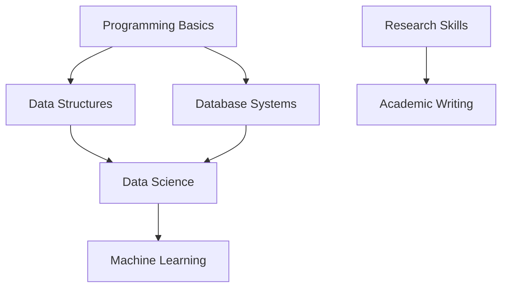

import { Callout } from 'fumadocs-ui/components/callout';
import { Card, Cards } from 'fumadocs-ui/components/card';
import { Steps } from 'fumadocs-ui/components/steps';

# Semester 1 Course Notes

## Core Courses
<Cards>
  <Card
    title="COMPSCI4084"
    description="Programming and Systems Development - Python, Java, Databases, Unix/Linux"
    href="/en/notes/semester-1/COMPSCI4084"
  />
  <Card
    title="COMPSCI5089"
    description="Introduction to Data Science and Systems - Data Science, Statistical Analysis, Machine Learning"
    href="/en/notes/semester-1/COMPSCI5089"
  />
  <Card
    title="COMPSCI5100"
    description="Machine Learning & Artificial Intelligence - ML, Deep Learning, AI Systems"
    href="/en/notes/semester-1/COMPSCI5100"
  />
</Cards>

## Skills Courses
<Cards>
  <Card
    title="Research Professional Skills"
    description="Research Methodology, Academic Writing, Literature Review, Presentation Skills"
    href="/en/notes/semester-1/research-professional-skills"
  />
</Cards>

## Semester Overview
The first semester focuses on building a foundation in programming and data science to prepare for advanced courses.

### Key Learning Areas
1.  **Programming Skills** - Python and Java programming
2.  **Systems Knowledge** - Unix/Linux system operations
3.  **Data Processing** - Data analysis and visualization
4.  **Machine Learning** - Fundamental algorithms and deep learning
5.  **Academic Skills** - Research methods and academic writing

### Course Relationships

The courses have a progressive relationship: programming basics support data science studies, which in turn provide a foundation for machine learning.
