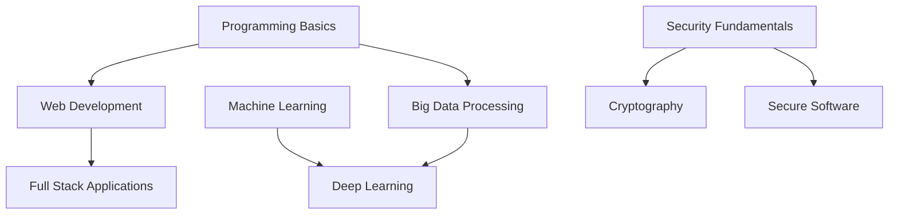

import { Card, Cards } from 'fumadocs-ui/components/card';

# Semester 2 Course Notes

## Core Courses

<Cards>
  <Card
    title="COMPSCI5012"
    description="Internet Technology - Web application design, system architecture, Django framework"
    href="/en/notes/semester-2/COMPSCI5012"
  />
  <Card
    title="COMPSCI4064/5088"
    description="Big Data - Hadoop, Spark, distributed computing frameworks"
    href="/en/notes/semester-2/COMPSCI4064-5088"
  />
  <Card
    title="COMPSCI5103"
    description="Deep Learning - Neural networks, CNN, RNN, PyTorch"
    href="/en/notes/semester-2/COMPSCI5103"
  />
  <Card
    title="COMPSCI5057"
    description="HCI Design & Evaluation - User-centered design, usability testing"
    href="/en/notes/semester-2/COMPSCI5057"
  />
  <Card
    title="COMPSCI5079"
    description="Cryptography & Secure Development - Encryption, secure coding"
    href="/en/notes/semester-2/COMPSCI5079"
  />
  <Card
    title="COMPSCI5093/5104"
    description="Secured Software Engineering - Secure SDLC, threat modeling"
    href="/en/notes/semester-2/COMPSCI5093-5104"
  />
</Cards>

## Semester Overview

The second semester focuses on advanced topics and practical applications.

### Key Learning Areas

1. **Web Development** - Django framework and web application design
2. **Big Data** - Distributed computing with Hadoop and Spark
3. **Deep Learning** - Neural networks and modern AI techniques
4. **Human-Computer Interaction** - User-centered design principles
5. **Security** - Cryptography and secure software development
6. **Research** - Dissertation project preparation

### Course Relationships

The courses build on first semester foundations, with machine learning knowledge supporting deep learning studies.