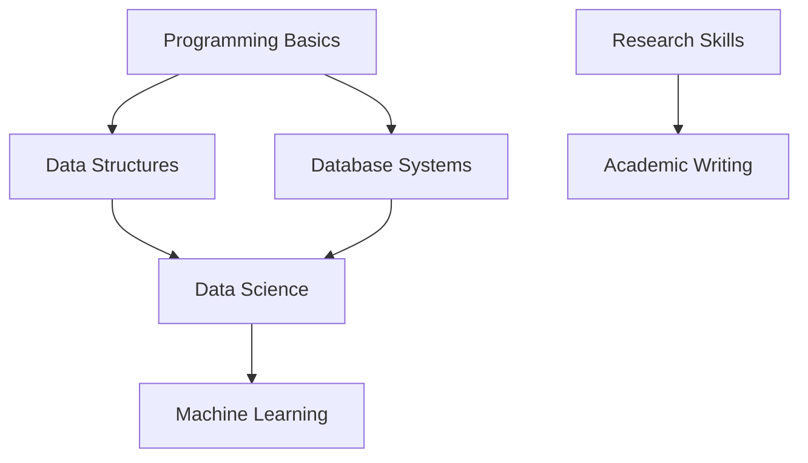

import { Card, Cards } from 'fumadocs-ui/components/card';

# 第一学期课程笔记

## 核心课程

<Cards>
  <Card 
    title="COMPSCI4084" 
    description="Programming and Systems Development - Python, Java, 数据库, Unix/Linux"
    href="/notes/semester-1/COMPSCI4084"
  />
  <Card 
    title="COMPSCI5089" 
    description="Introduction to Data Science and Systems - 数据科学, 统计分析, 机器学习"
    href="/notes/semester-1/COMPSCI5089"
  />
  <Card 
    title="COMPSCI5100" 
    description="Machine Learning & Artificial Intelligence - ML, 深度学习, AI系统"
    href="/notes/semester-1/COMPSCI5100"
  />
</Cards>

## 技能课程

<Cards>
  <Card 
    title="Research Professional Skills" 
    description="研究方法论, 学术写作, 文献综述, 演示技巧"
    href="/notes/semester-1/research-professional-skills"
  />
</Cards>

## 学期总览

第一学期主要建立编程基础和数据科学基础，为后续的高级课程做准备。

### 重点学习领域

1. **编程技能** - Python和Java编程
2. **系统知识** - Unix/Linux系统操作
3. **数据处理** - 数据分析和可视化
4. **机器学习** - 基础算法和深度学习
5. **学术技能** - 研究方法和学术写作

### 课程关系

课程之间存在递进关系，编程基础支撑数据科学学习，数据科学为机器学习提供基础。
