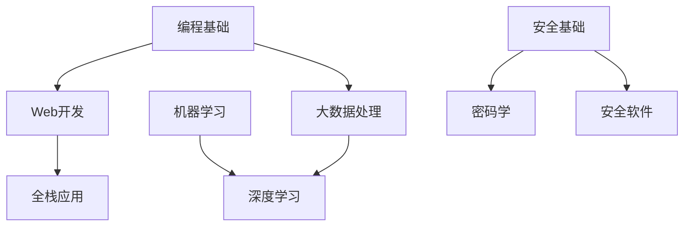

import { Card, Cards } from 'fumadocs-ui/components/card';

# 第二学期课程笔记

## 核心课程
<Cards>
  <Card
    title="COMPSCI5012"
    description="Internet Technology - Web应用设计，系统架构，Django框架"
    href="/zh/notes/semester-2/COMPSCI5012"
  />
  <Card
    title="COMPSCI5088"
    description="Big Data - Hadoop, Spark, 分布式计算框架"
    href="/zh/notes/semester-2/COMPSCI5088"
  />
  <Card
    title="COMPSCI5103"
    description="Deep Learning - 神经网络, CNN, RNN, PyTorch"
    href="/zh/notes/semester-2/COMPSCI5103"
  />
  <Card
    title="COMPSCI5057"
    description="人机交互设计与评估 - 以用户为中心的设计，可用性测试"
    href="/zh/notes/semester-2/COMPSCI5057"
  />
  <Card
    title="COMPSCI5079"
    description="密码学与安全开发 - 加密算法，安全编码"
    href="/zh/notes/semester-2/COMPSCI5079"
  />
  <Card
    title="COMPSCI5093/5104"
    description="安全软件工程 - 安全SDLC，威胁建模"
    href="/zh/notes/semester-2/COMPSCI5104"
  />
</Cards>

### 重点学习领域
1. **Web开发** - Django框架与Web应用设计
2. **大数据** - Hadoop和Spark分布式计算
3. **深度学习** - 神经网络与现代AI技术
4. **人机交互** - 以用户为中心的设计原则
5. **安全** - 密码学与安全软件开发
6. **研究** - 毕业论文项目准备

### 课程关系

课程建立在第一学期基础之上，机器学习知识为深度学习学习提供支撑。
