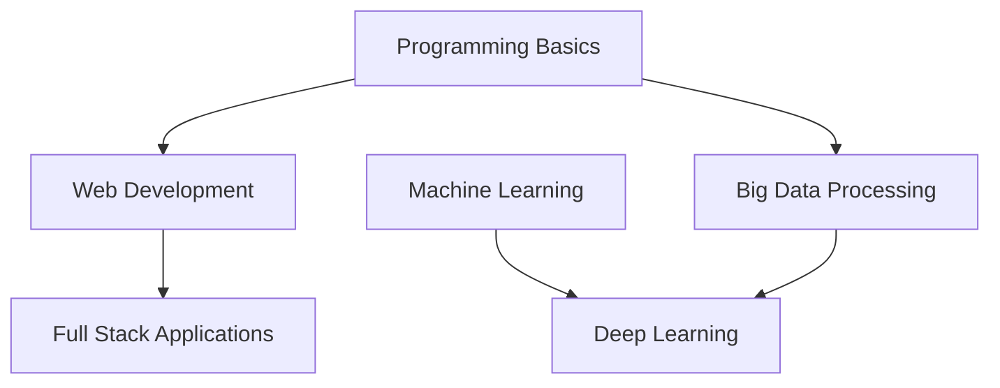

import { Card, Cards } from 'fumadocs-ui/components/card';

# 第二学期课程笔记

## 核心课程

<Cards>
  <Card
    title="COMPSCI5012"
    description="Internet Technology - Web应用设计，系统架构，Django框架"
    href="/zh/notes/semester-2/COMPSCI5012"
  />
  <Card
    title="COMPSCI4064/5088"
    description="Big Data - Hadoop, Spark, 分布式计算框架"
    href="/zh/notes/semester-2/COMPSCI4064-5088"
  />
  <Card
    title="COMPSCI5103"
    description="Deep Learning - 神经网络, CNN, RNN, PyTorch"
    href="/zh/notes/semester-2/COMPSCI5103"
  />
</Cards>

## 学期总览

第二学期主要专注于高级主题和实践应用。

### 重点学习领域

1. **Web开发** - Django框架与Web应用设计
2. **大数据** - Hadoop和Spark分布式计算
3. **深度学习** - 神经网络与现代AI技术
4. **研究** - 毕业论文项目准备

### 课程关系

课程建立在第一学期基础之上，机器学习知识为深度学习学习提供支撑。
